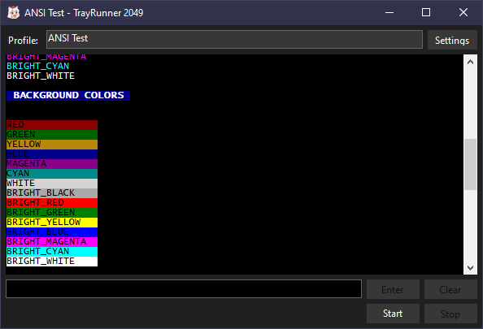

# TrayRunner 2049
Put and observe console applications in the system tray.

## Overview
If you are a Windows user and ever wanted to put your favourite Node.js application, Python script, or any other console application in the system tray and observe its output, then TrayRunner 2049 might be for you.



It is an open-source re-implementation of the original [Tray Runner](http://trayrunner.com/) software with some sensible modern conveniences I always wanted from the application.

The program is implemented in C# and uses .NET 9.0 + WinForms. Obviously, the source-code is available thus making it easy to extend and modify.

## Features
- Run console applications and put them in the system tray.
- Shows standard output and error output in a log window.
- Logs the original output to a dedicated log file.
- Supports ANSI codes for colored/formatted output.
- Support for Dark Mode.
- Configurable profile settings for each application
  - Command line parameters
  - Working directory
  - Icon
  - Output encoding
  - Auto restart
- Backwards-compatible with original Tray Runner profiles.

## Automatic Profile Execution
Simply call the `TrayRunner2049.exe` with the path to a profile file as an argument, and it will automatically execute the application defined in that profile. For example:

```shell
TrayRunner2049.exe "myProfile"
```

If the profile is found, it will automatically be loaded and started. TrayRunner 2049 will be minimized automatically and can be found in your tray area.

## Building
To build TrayRunner 2049, you need to have the .NET SDK installed. You can build the project using the following command:

```shell
dotnet build --configuration Release
```

You will find the built executable in the `TrayRunner2049/bin/Release/net9.0-windows` directory.

## Third Party
This software uses [Blue Mystic's DarkModeCS](https://github.com/BlueMystical/Dark-Mode-Forms), which is licensed under the MIT license. You can find the entire component under `TrayRunner2049/Components/DarkModeCS.cs`.

## License
TrayRunner 2049 is licensed under the MIT license, so please feel free to modify and improve the software for your own needs.
